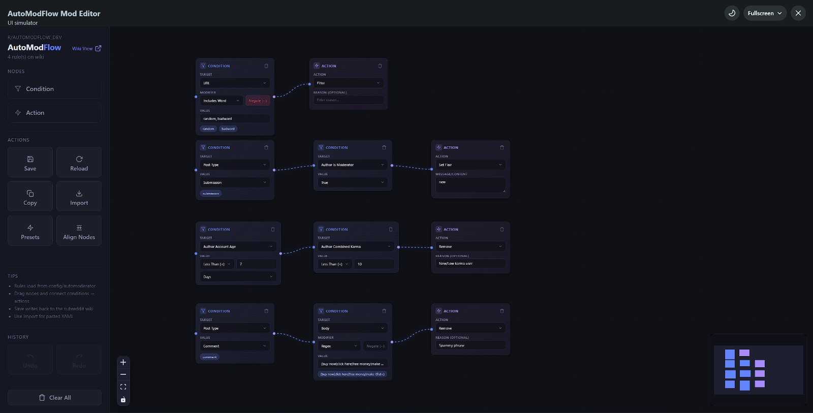
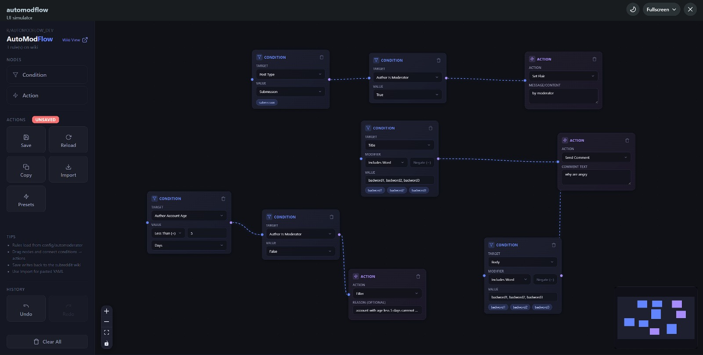
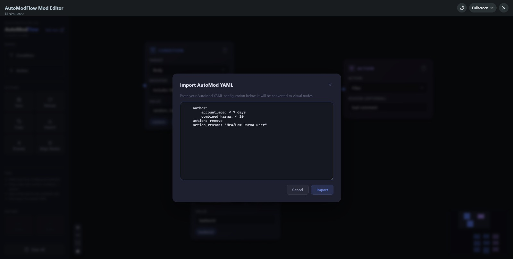
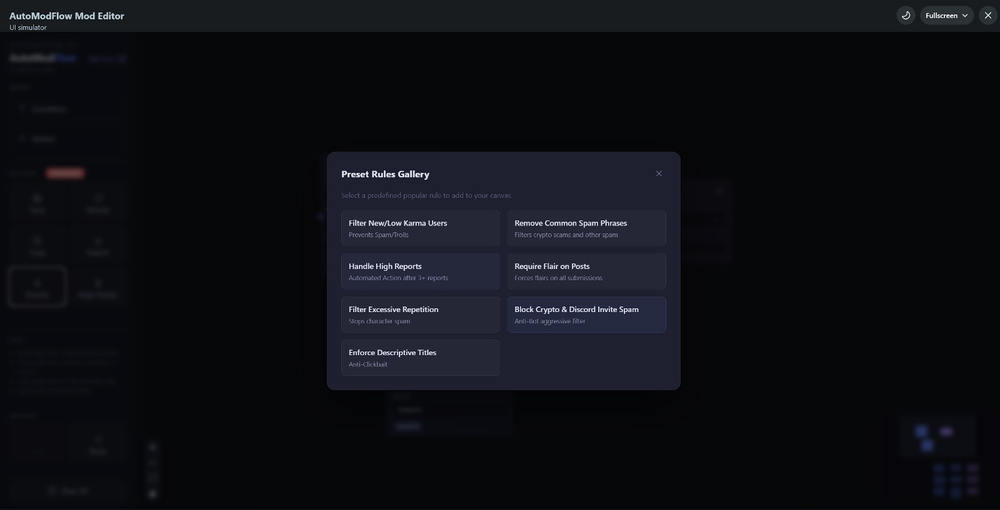

# AutoModFlow

> **Visual AutoModerator rule editor — built as a Reddit Devvit app.**  
> Stop writing YAML by hand. Drag, connect, and save moderation rules directly from your subreddit.

*(Click the image below to play the demo video)*<br/>
[](https://www.youtube.com/watch?v=xoIgNVIheeA)

---

## Table of Contents

1. [What is AutoModFlow?](#what-is-automodflow)
2. [How It Works — End-to-End Flow](#how-it-works--end-to-end-flow)
3. [Feature Breakdown](#feature-breakdown)
   - [Visual Canvas Editor](#-visual-canvas-editor)
   - [Condition Nodes](#-condition-nodes)
   - [Action Nodes](#-action-nodes)
   - [Smart Save & Load](#-smart-save--load)
   - [YAML Interoperability](#-yaml-interoperability)
   - [Preset Rules Gallery](#-preset-rules-gallery)
   - [History — Undo & Redo](#-history--undo--redo)
   - [Copy & Paste Nodes](#-copy--paste-nodes)
   - [Canvas Management](#-canvas-management)
   - [Toast Notification System](#-toast-notification-system)
   - [Moderator-Only Access Control](#-moderator-only-access-control)
   - [Hidden Config Post Management](#-hidden-config-post-management)
4. [Architecture](#architecture)
   - [High-Level Overview](#high-level-overview)
   - [Directory Layout](#directory-layout)
   - [Frontend (Client)](#frontend-client)
   - [Backend (Server)](#backend-server)
   - [YAML ↔ Flow Parser](#yaml--flow-parser-deep-dive)
5. [Tech Stack](#tech-stack)
6. [Getting Started](#getting-started)
7. [Commands](#commands)
8. [AutoMod Syntax Supported](#automod-syntax-supported)
9. [Keyboard Shortcuts](#keyboard-shortcuts)

---

## What is AutoModFlow?

AutoModFlow is a **Reddit Devvit web app** that gives subreddit moderators a drag-and-drop canvas to create, edit, and visualize [AutoModerator](https://www.reddit.com/wiki/automoderator) rules — without writing a single line of YAML.

The app lives inside Reddit itself. Moderators open it via the subreddit menu → it loads the current `config/automoderator` wiki page → renders every rule as a connected graph of nodes → lets you edit visually → saves back to the wiki when you're done.

**The loop is completely bidirectional:** wiki YAML → visual canvas on load, and visual canvas → wiki YAML on save.

---

## How It Works — End-to-End Flow

```
Moderator clicks
"Config AutoMod like a pro"
in the subreddit menu
         │
         ▼
[Server] menu.ts
  reddit.getCurrentSubreddit()
  getOrCreateConfigPost()        ← creates/reuses a locked+removed custom post
  redis.set(key, post.id)        ← stores the post ID so future clicks reuse it
         │
         ▼
Moderator is navigated to
the custom post (hidden
from the public feed)
         │
         ▼
[Client] splash.tsx mounts
  GET /api/automod-config
         │
         ▼
[Server] api.ts
  reddit.getModerators()         ← checks the caller is actually a mod
  reddit.getWikiPage(
    subredditName,
    'config/automoderator'
  )
         │
         ▼
[Client] YAML string returned
  yamlToState(yaml)              ← parses multi-doc YAML → NormalizedRule[]
  generateNodesFromRules(rules)  ← converts to React Flow nodes + edges
  ReactFlow renders the canvas
         │
         ▼
Moderator edits rules visually
(drag, connect, configure nodes)
         │
         ▼
[Client] "Save to Wiki" clicked
  generateAutomodYAML(nodes, edges)  ← compiles canvas → YAML string
  POST /api/automod-config
         │
         ▼
[Server] api.ts
  reddit.getModerators()         ← re-checks mod access
  YAML.loadAll()                 ← validates YAML before writing
  saveAutomodWikiYaml()          ← updates or creates the wiki page
         │
         ▼
AutoModerator on Reddit reads
the updated wiki page and
enforces the new rules
```

---

## Feature Breakdown

### 🖼️ Visual Canvas Editor

The heart of AutoModFlow. Built on **React Flow (XYFlow v12)**, the canvas is an infinite, pannable, zoomable workspace.

- **Infinite canvas** — rules are laid out on an unbounded 2D plane; pan with mouse-drag, zoom with scroll wheel
- **Dot-grid background** — subtle blue-tinted dots at 24px intervals give the canvas depth and spatial context
- **Built-in controls** — zoom-in, zoom-out, fit-view buttons rendered by React Flow's `<Controls />` component
- **MiniMap** — live overview of the entire canvas in the bottom-right; condition nodes shown in blue (`#6384ff`), action nodes in purple (`#a78bfa`)
- **Partial selection mode** — hold `Shift`, `Ctrl`, or `Cmd` and drag to select a region; only nodes whose bounding box intersects the selection box are included
- **Multi-node movement** — select several nodes and drag them all together
- **Drag-to-drop** — drag a node chip from the sidebar, drop it anywhere on the canvas; position snaps to the drop coordinate

---

### 🔵 Condition Nodes

Each Condition node represents one rule predicate — a thing AutoModerator checks. They are styled in blue and support the full spectrum of AutoMod condition syntax:

| Field | Description |
|---|---|
| **Target** | What to inspect: `title`, `body`, `domain`, `url`, `flair_text`, `type`, `reports`, `author.name`, `author.account_age`, `author.combined_karma`, and 12 more |
| **Modifier** | How to match: `includes` (default), `includes-word`, `match`, `starts-with`, `ends-with`, `regex`, `case-sensitive` |
| **Negate (~)** | Toggle button that prefixes the key with `~`, inverting the condition |
| **Value** | Context-aware input: free text / comma-separated list for most targets; boolean dropdown for author flags (`is_gold`, `has_verified_email`, etc.); threshold operator + number + optional time unit for karma/age/reports; post-type dropdown for the `type` target |

**Smart value input** — when the target is a threshold field like `author.account_age`, the value input transforms into three controls: an operator dropdown (`<`, `>`, `=`), a numeric input, and (for account age only) a time-unit dropdown (minutes → years). This produces the correct AutoMod syntax (e.g. `< 7 days`) automatically.

**Value badges** — after typing comma-separated values, each token is rendered as a pill/badge below the input field for easy scanning.

**Delete button** — per-node trash icon; if the node is selected as part of a multi-selection, deletes the entire selection; otherwise deletes only that node.

**Pop-in animation** — nodes animate in with a subtle scale-up on first render (`node-pop-in` CSS keyframe).

---

### ⚡ Action Nodes

Each Action node represents what AutoModerator should *do* when conditions are met. They are styled in purple and support every AutoMod action type:

| Action | Description |
|---|---|
| **Remove** | `action: remove` — removes the post/comment |
| **Spam** | `action: spam` — removes and marks as spam |
| **Approve** | `action: approve` |
| **Filter** | `action: filter` — sends to mod queue |
| **Report** | `action: report` |
| **Set Locked** | `set_locked: true` |
| **Set Sticky** | `set_sticky: true` |
| **Set NSFW** | `set_nsfw: true` |
| **Set Spoiler** | `set_spoiler: true` |
| **Send Comment** | `comment: <text>` — bot posts a comment |
| **Send Message** | `message: <text>` — DMs the author |
| **Send Modmail** | `modmail: <text>` — notifies the mod team |
| **Set Flair** | `set_flair: <text>` |
| **Overwrite Flair** | `overwrite_flair: <text>` |

For text-based actions (comment, message, modmail, flair), a textarea appears on the node for the content. For `action` types, an optional **Reason** field generates the `action_reason` (or `report_reason`) key in the YAML.

---

### 💾 Smart Save & Load

#### Loading
On mount, the client fetches `GET /api/automod-config`. The server reads the subreddit's `config/automoderator` wiki page. If the page doesn't exist, the canvas starts empty and shows an instructional banner. If it exists, the raw YAML is returned and parsed into nodes on the canvas.

The parser preserves **node positions** using a hidden metadata comment embedded in each YAML document (see [YAML ↔ Flow Parser](#yaml--flow-parser-deep-dive) below). This means you can reload the page and your canvas layout is exactly where you left it.

#### Saving
Clicking **Save** in the sidebar:
1. Validates the canvas is not empty
2. Checks every Condition node has a target selected
3. Checks every Action node has an action selected
4. Compiles the graph to YAML via `generateAutomodYAML()`
5. Posts to `/api/automod-config`
6. Server validates YAML syntax with `YAML.loadAll()` before writing
7. Server creates the wiki page if it doesn't exist, or updates it if it does
8. Success toast shows how many rules were saved

#### Unsaved Changes Indicator
Whenever the canvas state changes (node added, edge added/removed, node deleted), a red **UNSAVED** badge appears next to the Actions heading. It disappears after a successful save.

#### Reload Button
Re-fetches the wiki and rebuilds the canvas from scratch — useful after editing the wiki directly or after another mod makes changes.

#### Auto-Align
The **Align Nodes** button re-runs the `generateNodesFromRules()` layout algorithm on your current canvas, snapping every node into a clean grid (5 rows per column, 360px horizontal gap between nodes, 160px vertical gap between stacked actions) — without losing any rule data.

---

### 📜 YAML Interoperability

#### Import YAML
Click the **Import** button to open a modal with a monospace textarea. Paste any valid AutoModerator YAML (one or multiple documents separated by `---`). On clicking Import:
- `yamlToState()` parses it into `NormalizedRule[]`
- `generateNodesFromRules()` converts it to nodes, **appended** to the existing canvas (nodes are offset downward so they don't overlap)
- The canvas is updated and a toast confirms how many rules were imported

#### Copy YAML
Click **Copy** to compile the current canvas back to AutoMod YAML and write it to the clipboard. Useful for reviewing the output or pasting it somewhere else.

#### Two-Way Fidelity
The parser is designed so that round-tripping (`yaml → canvas → yaml`) preserves all semantic meaning:
- Negation (`~`) is preserved
- Modifiers (`regex`, `includes-word`, etc.) are preserved
- Author nested objects are flattened to dot-notation on import and reconstructed on export
- Combined keys (`title+body`) are split into separate condition nodes on import

---

### ⚡ Preset Rules Gallery

Click **Presets** to open a 2-column gallery of ready-made rules that cover the most common moderation use-cases:

| Preset | What it does |
|---|---|
| **Filter New/Low Karma Users** | Removes posts from accounts `< 7 days` old or `< 10` combined karma |
| **Remove Common Spam Phrases** | Regex filter for "buy now", "free money", crypto phrases |
| **Handle High Reports** | Auto-removes after 3+ community reports; sends modmail |
| **Require Flair on Posts** | Filters unflaired submissions; leaves a comment |
| **Filter Excessive Repetition** | Detects repeated character patterns like "aaaaaaa" |
| **Block Crypto & Discord Invite Spam** | Aggressive regex for crypto/invite-link patterns |
| **Enforce Descriptive Titles** | Filters titles that are too short, all caps, or over-punctuated |

Click any card to instantly inject that preset as new nodes on the canvas.

---

### ⏪ History — Undo & Redo

Full action history with up to **50 snapshots** stored in memory.

- A snapshot is pushed whenever a meaningful change occurs: node added, node removed, edge added, edge removed
- Pure movement (dragging a node around) does **not** push a history snapshot to avoid polluting the stack
- **Undo** (`Ctrl+Z` / `Cmd+Z` or sidebar button): pops the last snapshot, pushes current state to the redo stack
- **Redo** (`Ctrl+Shift+Z` / `Ctrl+Y` or sidebar button): pops from the redo stack, pushes current state back to history
- Redo stack is cleared whenever a new non-undo change is made (standard behavior)
- Buttons are disabled (greyed out) when the respective stack is empty

---

### 📋 Copy & Paste Nodes

- **Copy** (`Ctrl+C` / `Cmd+C`): captures all currently selected nodes and the edges between them into an in-memory clipboard ref
- **Paste** (`Ctrl+V` / `Cmd+V`): duplicates the clipboard contents with new IDs, offset by 44px × paste-count so each paste is visible; the pasted nodes are selected, the previous selection is deselected
- Works on any selection — a single node, a pair of connected nodes, or an entire sub-graph
- Keyboard shortcuts are only active when focus is not inside an `<input>`, `<textarea>`, or `<select>` to avoid conflicts

---

### 🗑️ Canvas Management

- **Clear All** button opens a confirmation modal (prevents accidental wipes)
- Confirmation modal shows a warning and requires an explicit "Clear All" click to proceed
- The clear action pushes a snapshot first, so it can be undone

---

### 🍞 Toast Notification System

A custom toast system (bottom-right corner) gives contextual feedback for every action:

| Type | Color | When shown |
|---|---|---|
| ✅ Success | Green (`#34d399`) | Saved, loaded, imported, copied, connected |
| ⛔ Error | Red (`#f87171`) | Parse failures, empty canvas, missing fields, network errors |
| ℹ️ Info | Blue (`#6384ff`) | Undo/redo confirmations, node added/connected messages |

Toasts auto-dismiss after 4 seconds. A new toast replaces the old one immediately if triggered before the timer expires.

---

### 🔐 Moderator-Only Access Control

Every API endpoint on the server checks moderator status before doing anything:

```typescript
// src/server/routes/api.ts
const isCurrentUserModerator = async (subredditName: string) => {
  const username = await reddit.getCurrentUsername();
  const moderators = await reddit.getModerators({ subredditName, username, limit: 1 }).all();
  return moderators.some(m => m.username.toLowerCase() === username.toLowerCase());
};
```

- `GET /api/automod-config` — returns 403 if the caller is not a mod
- `POST /api/automod-config` — returns 403 if the caller is not a mod
- The menu item itself is declared `"forUserType": "moderator"` in `devvit.json` so it's invisible to regular users

---

### 🔒 Hidden Config Post Management

When a moderator triggers the menu action for the first time:

1. Server checks Redis for a stored post ID (`automodflow:<subredditName>:config-post`)
2. If found, it fetches the post and hides it (lock + remove from feed)
3. If not found, it creates a new custom post with `reddit.submitCustomPost()` and stores the ID in Redis
4. The moderator is navigated to the post's permalink

This means there's always exactly one AutoModFlow editor post per subreddit, reused across all future sessions. The post is never visible in the public feed — it's locked and removed (modlog-only).

---

## Architecture

### High-Level Overview

```
Reddit.com
    │
    ├─ Subreddit mod menu
    │       "Config AutoMod like a pro"
    │                │
    │                ▼
    │      Devvit Menu Handler
    │      (src/server/routes/menu.ts)
    │                │
    │      getOrCreateConfigPost()
    │      (src/server/core/post.ts)
    │                │
    │      navigateTo(post.permalink)
    │
    └─ Custom Post (iFrame)
            │
            ▼
    React App (src/client/splash.tsx)
            │
            ├─ ReactFlow canvas
            │   ├─ ConditionNode (src/client/nodes/ConditionNode.tsx)
            │   └─ ActionNode    (src/client/nodes/ActionNode.tsx)
            │
            ├─ YAML Compiler (src/client/utils/yamlCompiler.ts)
            │   ├─ yamlToState()           YAML → NormalizedRule[]
            │   ├─ generateNodesFromRules() NormalizedRule[] → {nodes, edges}
            │   ├─ generateAutomodYAML()   {nodes, edges} → YAML string
            │   └─ stateToYaml()           NormalizedRule[] → YAML string
            │
            └─ HTTP API (fetch)
                    │
                    ▼
            Hono Server (src/server/index.ts)
                    │
                    ├─ GET /api/automod-config
                    │       (src/server/routes/api.ts)
                    │       → automodWiki.getAutomodWikiState()
                    │         (src/server/core/automodWiki.ts)
                    │
                    └─ POST /api/automod-config
                            → automodWiki.saveAutomodWikiYaml()
```

---

### Directory Layout

```
automodflow/
├── devvit.json              # Devvit app config — permissions, menu items, entrypoints
├── package.json
├── vite.config.ts           # Vite build (client + server bundles)
├── src/
│   ├── client/
│   │   ├── splash.html      # HTML entry point (iFrame)
│   │   ├── main.tsx         # React root mount
│   │   ├── splash.tsx       # Main app component (1747 lines)
│   │   │                    #  — Canvas, sidebar, modals, undo/redo, DnD
│   │   ├── index.css        # Global styles + animations
│   │   ├── nodes/
│   │   │   ├── ConditionNode.tsx   # Blue Condition node component
│   │   │   └── ActionNode.tsx      # Purple Action node component
│   │   └── utils/
│   │       └── yamlCompiler.ts     # Bidirectional YAML ↔ Flow parser (779 lines)
│   └── server/
│       ├── index.ts                # Hono app — mounts /api and /internal/menu routes
│       ├── routes/
│       │   ├── api.ts              # GET/POST /api/automod-config
│       │   ├── menu.ts             # POST /internal/menu/config-automod
│       │   └── triggers.ts         # onAppInstall trigger handler
│       └── core/
│           ├── automodWiki.ts      # reddit.getWikiPage / createWikiPage / update
│           └── post.ts             # getOrCreateConfigPost (Redis-backed)
```

---

### Frontend (Client)

The entire frontend is a single React 19 component tree rendered inside a Devvit iFrame.

**`splash.tsx`** — the main component, `FlowCanvas`, manages:

| Concern | Implementation |
|---|---|
| Node/edge state | `useNodesState`, `useEdgesState` from `@xyflow/react` |
| Undo/redo | Manual stack with `useRef<FlowSnapshot[]>` — avoids re-render on every push |
| Dirty tracking | `useState(dirty)` — set true on any meaningful change, false after save/load |
| Clipboard | `useRef<ClipboardSelection>` — stores deep clones of selected nodes/edges |
| Toast | `useState(toast)` + `setTimeout` — one toast at a time, auto-dismissed |
| Drag-and-drop | `onDragStart` on sidebar chips, `onDrop` + `screenToFlowPosition` on canvas |
| Loading state | `useState(isLoadingConfig)` — shows a blurred overlay with a spinner |

**`ConditionNode.tsx`** and **`ActionNode.tsx`** each receive their data via React Flow's node `data` prop and write back changes via `updateNodeData(id, patch)`. They use a custom `NodeDropdown` component (a stylized `<button>`-based dropdown, not a native `<select>`) to work correctly inside the React Flow canvas (where native inputs can steal focus or interfere with pan/zoom).

---

### Backend (Server)

A minimal **Hono** HTTP server running in Devvit's serverless Node 22 environment.

#### `GET /api/automod-config?subredditName=<name>`
1. Validates `subredditName` is present
2. Calls `isCurrentUserModerator()` → 403 if not a mod
3. Calls `getAutomodWikiState()` — catches not-found errors and returns `{ wikiExists: false, yaml: '' }` gracefully
4. Returns JSON: `{ subredditName, yaml, wikiPage, wikiExists, ruleCount }`

#### `POST /api/automod-config`
Body: `{ subredditName, yaml }`
1. Validates fields
2. Calls `isCurrentUserModerator()` → 403 if not a mod
3. Validates the YAML with `YAML.loadAll()` — returns 400 on parse error
4. Calls `saveAutomodWikiYaml()` — tries to update, creates if missing
5. Returns the same shape as GET, plus `wikiCreated: boolean`

#### `automodWiki.ts`
Wraps the three Reddit wiki API calls:
- `reddit.getWikiPage(subredditName, 'config/automoderator')` — read
- `page.update(content, reason)` — update existing
- `reddit.createWikiPage({...})` — create new

#### `post.ts`
- Keeps one config post per subreddit in Redis under key `automodflow:<name>:config-post`
- If the Redis key exists but the post was deleted, the key is cleared and a new post is created
- The post is created with `spoiler: true`, `sendreplies: false`, then immediately locked and removed from the feed

---

### YAML ↔ Flow Parser Deep Dive

The parser (`src/client/utils/yamlCompiler.ts`) is the technical core of the project. It handles the full round-trip between raw AutoMod YAML and React Flow graph state.

#### Part 1: Normalized Data Layer

Three TypeScript interfaces form the internal representation:

```typescript
interface NormalizedCondition {
  target: string;            // "title", "body", "author.account_age", etc.
  modifier: string;          // "includes", "regex", "starts-with", etc.
  negated: boolean;          // true if key was prefixed with ~
  value: string | string[];  // the match value(s)
  sourceRef?: string;        // node ID — used to restore positions
}

interface NormalizedAction {
  actionType: string;        // "action", "comment", "modmail", etc.
  value: string | boolean | Record<string, unknown>;
  reason?: string;           // action_reason / report_reason / message_subject
  sourceRef?: string;        // node ID — used to restore positions
}

interface NormalizedRule {
  id: string;
  conditions: NormalizedCondition[];
  actions: NormalizedAction[];
  groupMeta?: RuleGroupMeta; // saved node positions + node IDs
}
```

#### Part 2: YAML → Normalized State (`yamlToState`)

Handles the full complexity of AutoMod YAML:

| Feature | Example | Result |
|---|---|---|
| Multi-doc split | `---` separator | Each `---` block → one `NormalizedRule` |
| Negation | `~title: spam` | `{ negated: true }` |
| Modifier | `body (regex): pattern` | `{ modifier: "regex" }` |
| Combined keys | `title+body: spam` | Two conditions (one per target) |
| Nested author | `author: { account_age: "< 7 days" }` | `{ target: "author.account_age", value: "< 7 days" }` |
| Array normalization | `title: spam` | `{ value: ["spam"] }` |
| Action grouping | `action: remove` + `action_reason: x` | Single `NormalizedAction` with `reason: x` |

#### Part 3: Normalized State → React Flow (`generateNodesFromRules`)

Converts `NormalizedRule[]` to `{ nodes, edges }`:

- Condition nodes: blue, laid out left-to-right in a chain
- Action nodes: purple, stacked vertically to the right of the last condition
- Edges: condition→condition edges are cyan (`#38bdf8`); condition→action edges are fuchsia (`#e879f9`); all edges are animated
- Layout: 5 rows per column, 360px horizontal gap, 160px vertical gap between stacked actions, 100px vertical gap between rules in the same column
- Saved positions: if a node has a `sourceRef` and the YAML document contains position metadata, the saved `{x, y}` is used instead of the auto-layout

#### Part 4: React Flow → YAML (`generateAutomodYAML`)

Traverses the graph to reconstruct rules:

1. Builds `incoming` edge map: `target → [sources]`
2. For each action node, traces all inbound condition paths using `getConditionPaths()` (recursive DFS)
3. Groups actions that share the same condition path into one rule
4. Serializes each group via `stateToYaml()`, which calls `YAML.dump()` and prepends position metadata

#### Part 5: Position Persistence Metadata

To remember where you placed nodes, AutoModFlow embeds a tiny metadata comment at the top of each YAML document:

```yaml
# automodflow: eyJjIjpbIi4uLiJdLCJhIjpbIi4uLiJdLCJwIjp7Ii4uLiJ9fQ
title: spam
action: remove
```

The comment contains a **URL-safe Base64** encoding of a compact JSON object:

```json
{ "c": ["conditionNodeId"], "a": ["actionNodeId"], "p": { "nodeId": { "x": 120, "y": 340 } } }
```

On load, `extractGroupMetaFromDocText()` scans each document's raw text for this comment, decodes it, and uses the saved positions instead of the auto-layout. This is **completely transparent** to AutoModerator — it ignores YAML comments.

---

## Tech Stack

| Layer | Technology |
|---|---|
| **Platform** | [Devvit](https://developers.reddit.com/docs) (Reddit's app platform) |
| **Frontend** | React 19, [@xyflow/react](https://reactflow.dev) v12 |
| **Backend** | Node.js 22, [Hono](https://hono.dev) 4 |
| **YAML parsing** | [js-yaml](https://github.com/nodeca/js-yaml) 4 |
| **Build** | Vite 8 |
| **Type safety** | TypeScript 6 |
| **Storage** | Reddit Wiki (rule data) + Devvit Redis (post ID cache) |
| **Lint/Format** | ESLint 10 + Prettier 3 |

---

## Getting Started

```bash
# Install dependencies
npm install

# Log in to Devvit
npm run login

# Start the development playtest server
npm run dev
```

Requires **Node.js 22+** and the [Devvit CLI](https://developers.reddit.com/docs).

During development, the app playtests against the subreddit defined in `devvit.json`:
```json
"dev": { "subreddit": "automodflow_dev" }
```

---

## Commands

| Command | Description |
|---|---|
| `npm run dev` | Start playtest with live rebuild (Devvit + Vite watch mode) |
| `npm run build` | Build client + server bundles to `dist/` |
| `npm run deploy` | Type-check + lint + upload to Reddit |
| `npm run launch` | Deploy and publish the app publicly |
| `npm run type-check` | Run TypeScript compiler in check mode |
| `npm run lint` | Run ESLint across all `src/**/*.{ts,tsx}` |
| `npm run prettier` | Format all files with Prettier |

---

## AutoMod Syntax Supported

### Condition Targets
`title` · `body` · `domain` · `url` · `flair_text` · `flair_css_class` · `flair_template_id` · `reports` · `id` · `type` · `author.name` · `author.is_gold` · `author.is_submitter` · `author.is_contributor` · `author.is_moderator` · `author.has_verified_email` · `author.satisfy_any_threshold` · `author.account_age` · `author.post_karma` · `author.comment_karma` · `author.combined_karma` · `author.post_subreddit_karma` · `author.comment_subreddit_karma`

### Modifiers
`includes` · `includes-word` · `match` · `starts-with` · `ends-with` · `regex` · `case-sensitive`

### Actions
`action` (remove / spam / approve / filter / report) · `action_reason` · `report_reason` · `comment` · `message` · `message_subject` · `modmail` · `modmail_subject` · `set_locked` · `set_sticky` · `set_nsfw` · `set_spoiler` · `set_flair` · `overwrite_flair`

---

## Keyboard Shortcuts

| Shortcut | Action |
|---|---|
| `Ctrl+Z` / `Cmd+Z` | Undo |
| `Ctrl+Shift+Z` / `Ctrl+Y` | Redo |
| `Ctrl+C` / `Cmd+C` | Copy selected nodes |
| `Ctrl+V` / `Cmd+V` | Paste copied nodes |
| `Shift` / `Ctrl` / `Cmd` + drag | Multi-select region |

> Keyboard shortcuts are disabled while focus is inside any text input, textarea, or select, to prevent conflicts with typing.

---

## License

BSD 3-Clause — see [LICENSE](./LICENSE).

## Demo Images

### Dashboard


### Dashboard (Zoomed In)


### Import AutoMod YAML


### Preset Gallery


